# Desafio Builders

Desafio para a seleção da seleção de desenvolvedor Sr. para empresa builders que consistiu em uma aplicação que apresenta a previsão do tempo baseado na geolocalização. Aplicado testes end 2 end e testes de unidade.
<br/>
<br/>

## Funcionalidades
- Carregar previsão do tempo baseado na localização do dispositivo
- Visualiazr previsão do tempo atual
- Visualizar a previsão do tempo em horas do dia seguinte
- Visualizar previsão do tempo dos próximos 5 dias.
- Buscar previsão do tempo pelo nome da cidade.
- Cores baseado no período do dia (manhã, tarde e noite)
  <br/>
  <br/>

## Manhã

  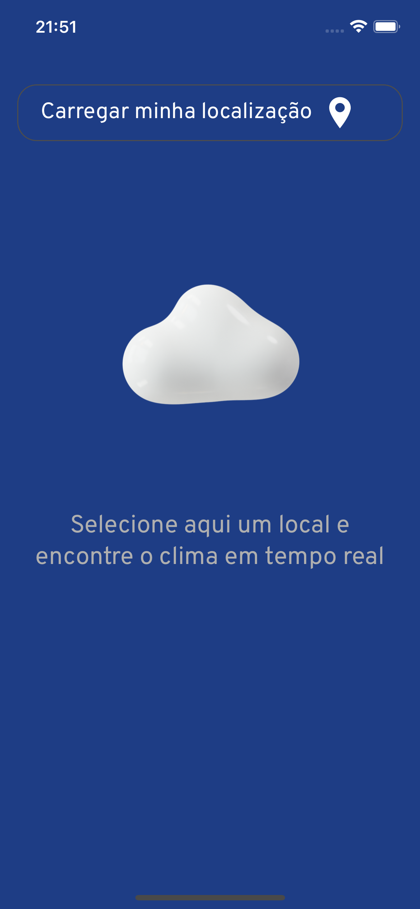
  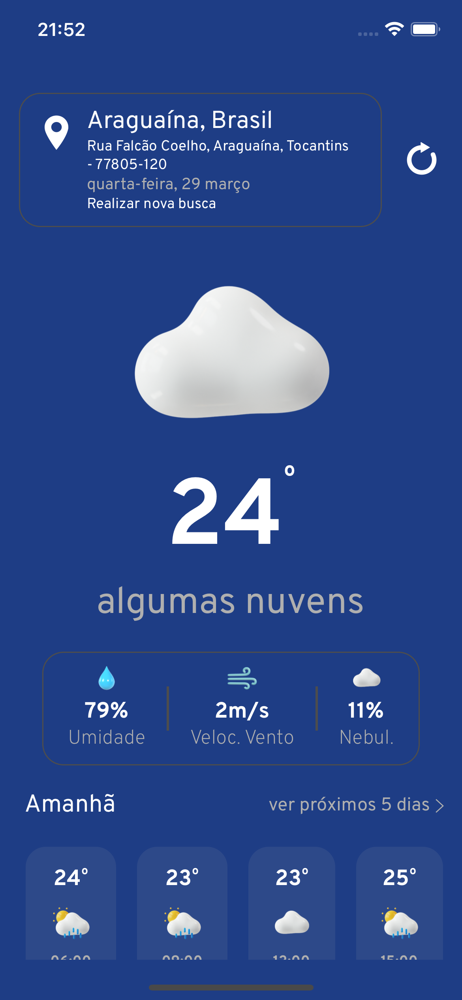
  
  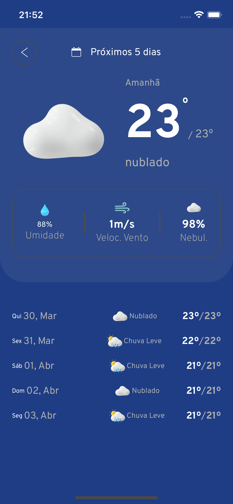
  

## Tarde

  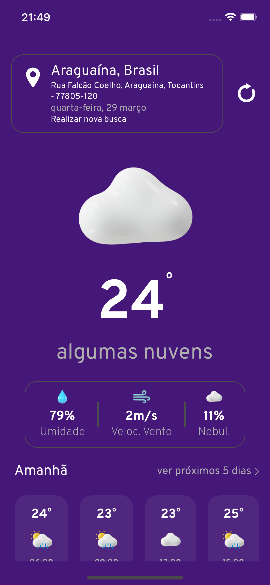
  
  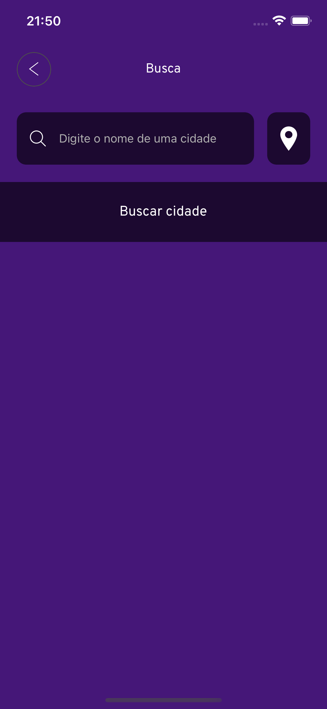
  
  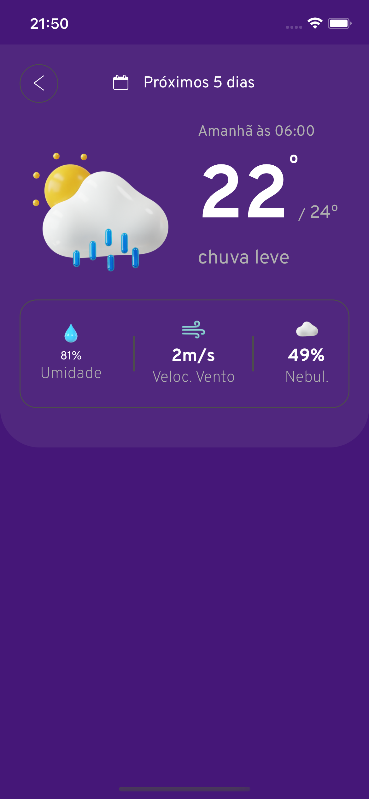

## Noite

  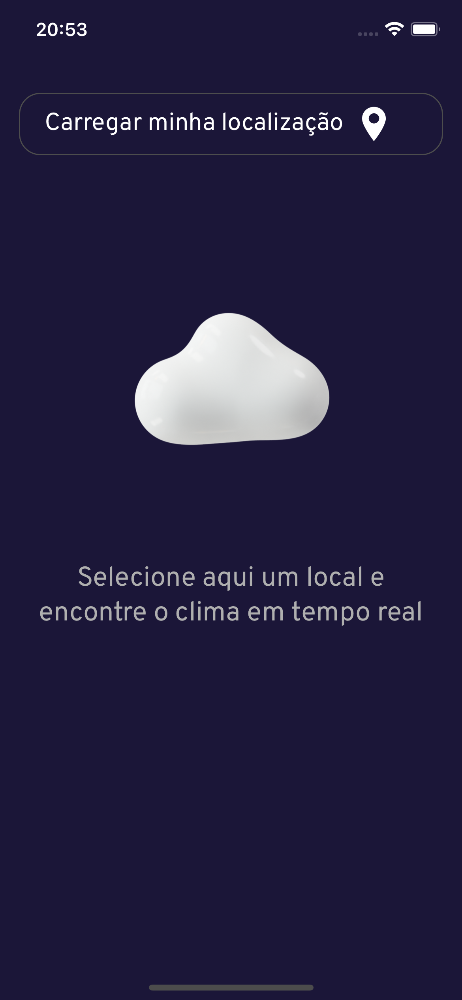
  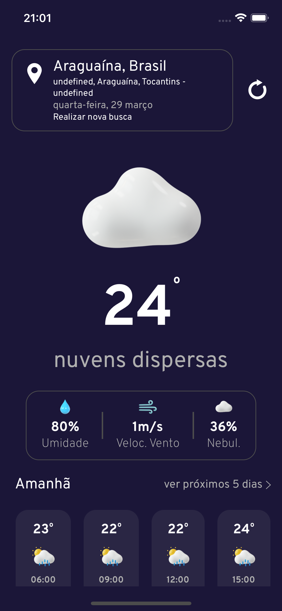
  
  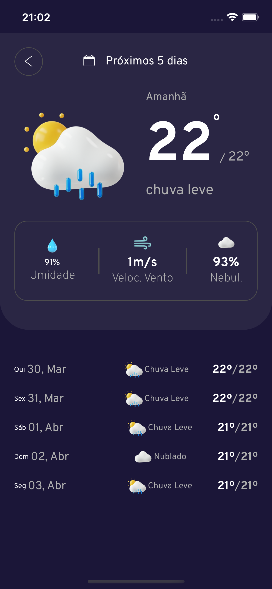
  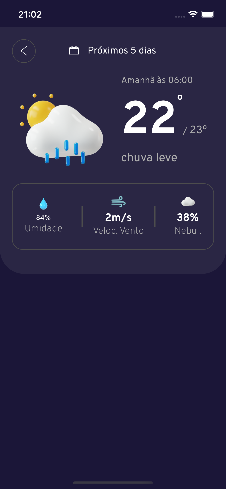
  <br/>
  <br/>

# Arquitetura, stack, api e bibliotecas

Este projeto foi construído baseado no mvc e models por se encaixar perfeitamente no ambiente react-native e aproveitar ao máximo seus componentes funcionais.
<br/>
<br/>

## API

Utilizou-se das seguintes APIs para integração do projeto

- openweathermap: carregar informações de clima
- opencagedata: para transformar coordenadas em localização e localização em cordenadas, pois o serviço de openweathermap não se adaptou muito bem à estes casos.

## Stack

Como já mencionado, foi utilizado no ambiente de desenvolvimento o react-native juntamente com typeScript.

## Bibliotecas

- @react-native-community/geolocation: Coleta a localização do dispositivo.
- @react-navigation/native e @react-navigation/native-stack para navegação no estilo pilha
- react-redux juntamente com @reduxjs/toolkit, o redux toolkit auxilia na integração de serviços com o redux transformando nossas actions em funções assíncronas.
- jest e @testing-library/react-native para realizar os testes unitários
- detox para realizar nossos testes de e2e
- axios para se conectar às APIs
- Date fns e moment, pois, dentro do projeto cada uma dessas bibliotecas de data se mostrou em suas especificidade mais fáceis de se aplicar em diferentes abordagem, não apenas formatação.
- react-native- svg foi fundamento para a utilização de icones svg
  -styleds componets para deixar nossas estilizações mais legíveis
  -Demais libs são apoio ou dependências que não estão diretamente ligadas ao desenvolvimento.

## Variáveis de ambiente

Para este projeto não houve a necessidade da criação de variáveis de ambientes, mas foram setadas variáveis globais de chaves de acesso. sendo elas
<br/>

- `LOCATION_KEY`
- `WEATHER_KEY`

# Para rodar

Para rodar o projeto é necessário ter ambiente de desenvolvimento configurado, [saiba mais](https://reactnative.dev/docs/environment-setup).

Após ambiente configurado siga:

clone o projeto

```bash
 git clone https://github.com/suhmah/desafioBuilders.git
```

Instale as dependências

```bash
  yarn
```

Instale e rode o bundle.

IOS

```bash
  yarn ios
```

android

```bash
  yarn ios
```

# Switch case para setar icones de acordo com o status e período do dia

Este switch case foi criado pois as imagens da api `openweathermap` são pequenas, logo, para icones grandes não ficou boas.

# Conceito;

em `futils/orecastIcon.ts` temos função switch que recebe:


## Entrada
| Parâmetro          | Tipo      | Descrição                        |
| :----------------- | :-------- | :------------------------------- |
| `weatherCondition` | `string`  | **Obrigatório**. status do clima |
| `isMiddle`         | `boolean` | **Obrigatório**. se é tarde      |
| `isMorning`        | `boolean` | **Obrigatório**. se é manhã      |

## Saída

| Retorna          | Tipo      | Descrição                        |
| :----------------- | :-------- | :------------------------------- |
| `Color` | `string`  | Cor para ser utilizado no background da aplicação |
| `Icon`         | `string` | Path de icone     |

 

## A função

Em seguida, entrando em loop ele calcula qual icone irá retornar. Os icones estão na pasta `src/assets`.

Este é um recorte pequeno desta função

```javascript
import LightRainPNG from '../assets/light-rain.png';
import LightRainMiddlePNG from '../assets/light-rain-middle.png';
import LightRainNightPNG from '../assets/light-rain-night.png';
import {Color} from '../styles/colors';

export const forecastConditionsIcons = (
  weatherCondition: string,
  isMiddle: boolean,
  isMorning: boolean,
) => {
  switch (
    weatherCondition.charAt(0).toUpperCase() + weatherCondition.slice(1)
  ) {
    case 'Chuvisco':
      if (isMorning) {
        return {
          icon: LightRainPNG,
          color: Color.status.light.background,
        };
      } else if (isMiddle) {
        return {
          icon: LightRainMiddlePNG,
          color: Color.status.middle.background,
        };
      } else {
        return {
          icon: LightRainNightPNG,
          color: Color.status.night.background,
        };
      }
  }
};
```

## Cores

cores utilizadas para os status:

| Cor          | Hexadecimal                                                      |
| ------------ | ---------------------------------------------------------------- |
| isMorning    |  #1E3D85 |
| isMiddle     |  #451778 |
| Fuga (nigth) |  #1B1638 |

## chamando a função

```
 forecastConditionsIcons(
   "Chuvisco",
    true,
    false,
  ).icon || .color
```

# Calculando o Período

Esta função se encarrega de dizer qual é o período atual baseado na hora

````export const period = (preventHour: number | string) => {
  const isMiddle =
    (preventHour >= 3 && preventHour < 6) ||
    (preventHour >= 16 && preventHour < 18);
  const isMorning = preventHour >= 6 && preventHour <= 15;

  return {isMiddle, isMorning};
};
`````

# Entrada

## Entrada
| Parâmetro          | Tipo      | Descrição                        |
| :----------------- | :-------- | :------------------------------- |
| `preventHour` | `strin | String`  | Hora atual |
 
## Saída
| Parâmetro          | Tipo      |
| :----------------- | :-------- |
| `isMiddle` | `boolean`  |
| `isMorning` | `boolean`  |
 

Estas são as duas principais funções responsáveis por deixar a aplicação mais bonita!

# Testes unitários

Para rodar os teste de unidade basta rodar:

`yarn test`

 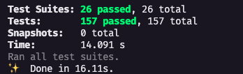
    
# Teste e2e  🚀

Para realizar os teste é necessário mocar uma gelocalização. No ios o detox persiste no erro de permissão. Então assumindo que a geolocalização está funcionando mocaremos estes dados

acesse o arquivo `src/services/getLocation.ts`

mocar a variável: mock
por exemplo:
`const mock = {lat: -7.163765, lon: -48.399673};`

Para Android ao setar um emulador com poucos recursos, falhará por frames nativos do detox.

Apesar de todos os problemas que ainda possui, o detox vem ganhando força, e com tempo todos os empecilhos podem ser resolvido seguindo forúns.


precisamos também informar ao detox qual emulador estamos usando,
[saiba mais](https://wix.github.io/Detox/docs/introduction/project-setup).


Para rodar nosso teste de unidade vamos rodas os seguintes comandos:

## IOS
preparar aplicação
<br />
```bash
bash detox build --configuration ios.sim.debug
```

rodar os teste
```bash
detox test --configuration ios.sim.debug
```
## Android
preparar aplicação
<br />
```bash
detox build --configuration android.emu.debug
```

rodar os teste
```bash
detox test --configuration android.emu.debug
```


https://user-images.githubusercontent.com/38407958/228709200-5fb22c75-d0d2-428b-acc9-4a6a1c898037.mp4


<br/>
note: clideo.com foi um serviço usado para comprimir o vídeo. o vídeo original está em `readme/testEnd2End`

