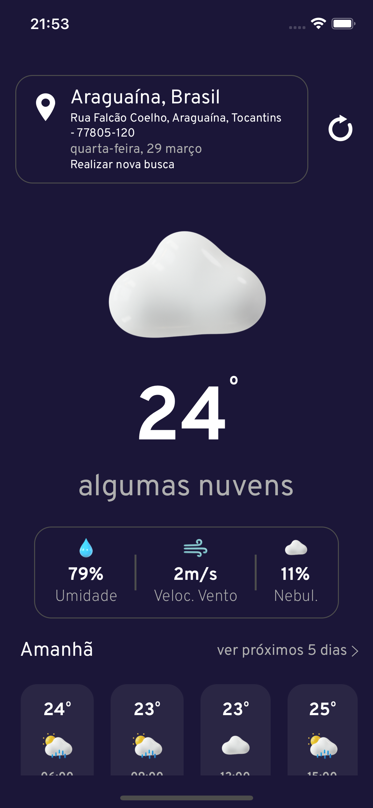

# Desafio Builders

Desafio para a seleção da seleção de desenvolvedor Sr. para empresa builders.
 
 
## Funcionalidades

- Carregar previsão do tempo baseado na localização do dispositivo
- Visiualizar previsão do tempo atual
- Visualizar a previsão do tempo em horas do dia seguinte
- Visualiazr previsão do tempo dos próximos 5 dias.
- Buscar previsão do tempo pelo nome da cidade.
 
 

  
   
   

# Arquitetura, stack, api e bibliotecas

Este projeto foi construído baseado no mvc e models por se encaixar perfeitamente no ambiente react-native e aproveitar ao máximos seus components funcionais.
 
 

## API
Utilizou-se das seguintes APIs para integração do projeto

- openweathermap: carregar informações de cilma
- opencagedata: para transformar cordenadas em localização e localização em cordenadas, pois o serviço de openweathermap não se adaptou muito bem à estes casos.

## Stack
 
Como já mencionado, foi utilizado no ambiente de desenvolvimento o react-native juntamente com typeScript.

## Bibliotecas
- @react-native-community/geolocation: Coleta a localização do dispositivo.
- @react-navigation/native e @react-navigation/native-stack para navegação no estilo pillha
- react-redux juntamente com @reduxjs/toolkit, o redux toolkit auxilia na integraçãod e serviços com o redux transformando nossas actions em funções asycronas.
- jest e @testing-library/react-native para realiar os testes unitários
- detox para realizar nossos testes de e2e
- axios para se conectar às APIs
- date fns e moment, pois, dentro do projeto cada uma dessas bibliotecas de data se monstrou em suas especificidade mais fáceis de se aplicar em diferentes abordagem, não apenas formatação.
- react-native- svg foi fundamento para a utilização de icones svg
-styleds componets para deixar nossas estilizações mais legiveis
-Demais libs são apoio ou dependências que não estão diretamente ligadas ao desenvolvimento.

## Variáveis de ambiente
Para este projeto não ouve a necessidade da criação de variáveis de ambientes, mas foram setadas variáveis globais de chaves de acesso. sendo elas
 
- `LOCATION_KEY`
- `WEATHER_KEY`